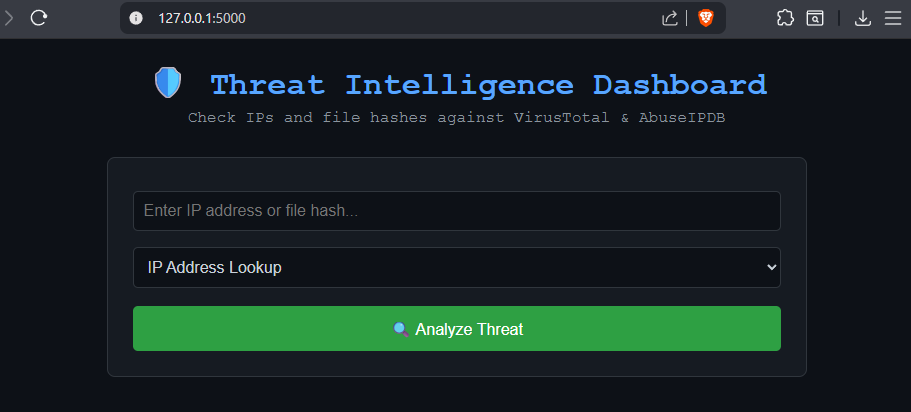
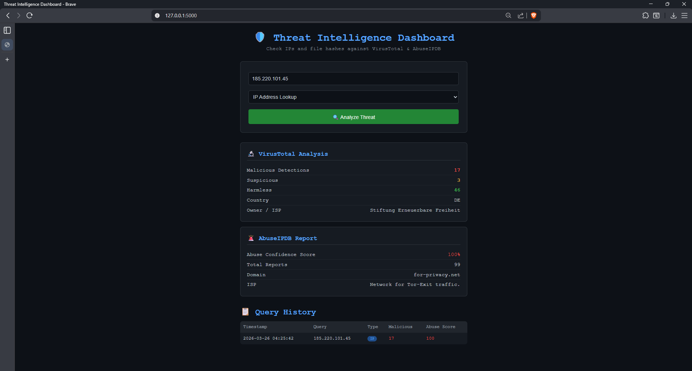
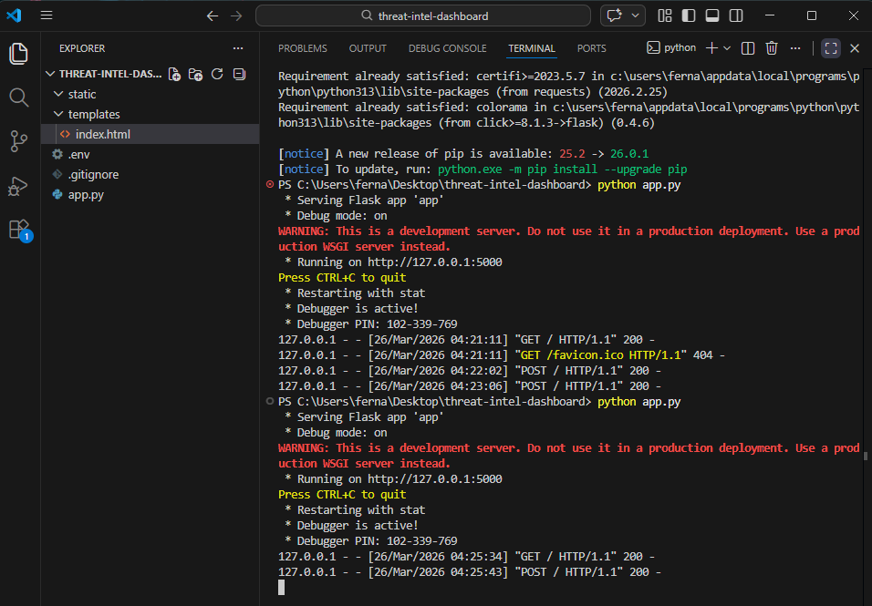
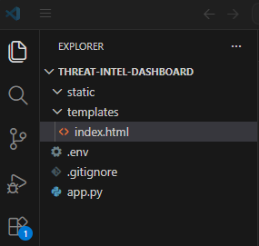

# 🛡️ Threat Intelligence Dashboard

A Python web application that performs real-time threat intelligence lookups against **VirusTotal** and **AbuseIPDB** APIs. Analysts can investigate suspicious IP addresses and file hashes through a clean browser-based dashboard with query history tracking.

---

## 📌 Project Overview

This tool simulates the kind of threat investigation workflow used by SOC analysts during incident response. Rather than manually visiting threat intel sites, analysts can query multiple sources simultaneously and track their investigation history — all from one interface.

---

## 🛠️ Tools & Technologies

| Tool | Purpose |
|------|---------|
| Python 3 | Core scripting language |
| Flask | Web framework for the dashboard |
| VirusTotal API | Check IPs/hashes against 70+ antivirus engines |
| AbuseIPDB API | Check IPs for abuse reports and confidence scores |
| Requests | HTTP API calls |
| python-dotenv | Secure API key management |
| HTML/CSS | Frontend dashboard interface |

---

## ✨ Features

- 🔍 **IP Address Lookup** — Query VirusTotal and AbuseIPDB simultaneously
- 🔬 **File Hash Lookup** — Check MD5/SHA256 hashes against VirusTotal
- 📊 **Color-coded threat levels** — Red for malicious, yellow for suspicious, green for clean
- 📋 **Query history tracking** — Log all lookups in a session table
- 🔐 **Secure API key management** — Keys stored in `.env`, never exposed in code

---

## 📁 Project Structure

```
threat-intel-dashboard/
├── static/                  # Static assets
├── templates/
│   └── index.html           # Dashboard frontend
├── screenshots/             # Project screenshots
├── .env                     # API keys (not uploaded to GitHub)
├── .gitignore               # Excludes .env from Git
└── app.py                   # Flask backend
```

---

## ⚙️ Installation

**Requirements:** Python 3.x

**1. Clone the repository:**
```bash
git clone https://github.com/cpt-ferna02/threat-intel-dashboard.git
cd threat-intel-dashboard
```

**2. Install dependencies:**
```bash
pip install flask requests python-dotenv
```

**3. Create a `.env` file with your API keys:**
```
VIRUSTOTAL_API_KEY=your_virustotal_key_here
ABUSEIPDB_API_KEY=your_abuseipdb_key_here
```

> Free API keys available at [virustotal.com](https://virustotal.com) and [abuseipdb.com](https://abuseipdb.com)

---

## 🚀 Usage

```bash
python app.py
```

Then open your browser and go to:
```
http://127.0.0.1:5000
```

---

## 📊 Sample Results — Real Threat Detected

Testing against a known malicious Tor exit node (`185.220.101.45`):

| Source | Result |
|--------|--------|
| VirusTotal | **17 malicious detections**, 3 suspicious |
| AbuseIPDB | **100% abuse confidence score**, 99 reports |
| Country | Germany (DE) |
| ISP | Network for Tor-Exit traffic |

---

## 📸 Screenshots

### Dashboard


### Malicious IP Detection


### Terminal Output


### Project Setup


---

## 🎯 Skills Demonstrated

- REST API integration (VirusTotal & AbuseIPDB)
- Python web development with Flask
- Secure credential management with `.env`
- Threat intelligence analysis workflow
- Frontend dashboard design (HTML/CSS)
- Real-world SOC analyst investigation simulation

---

## ⚠️ Security Notes

- Never commit your `.env` file to GitHub
- Rotate API keys regularly
- Free API tiers have rate limits — VirusTotal allows 4 lookups/min

---

## 👤 Author

**cpt-ferna02**  
Cyber Information Assurance Student  
[GitHub](https://github.com/cpt-ferna02)
